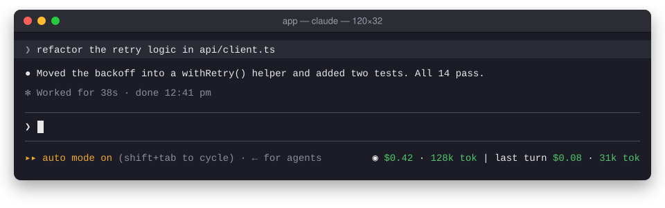

# Cost Info

A Claude Code mod that shows what your session has cost so far, and the tokens it took, live.



- **Under the prompt.** `◉ $0.16 · 142k tok | this turn $0.02 · 30k tok` at the right of the line under the prompt, the figures in green, live, mid-turn too; once the turn ends it reads `last turn`. A narrow terminal (under 120 columns) shows the session alone. The cost is the same figure `/cost` shows, subagents included.
- **Tokens.** Every model request's input, cache writes, cache reads and output, summed, subagents included.
- **Budget.** A one-time warning when the session crosses it.
- **`/spend`.** Tokens, turns, average per turn, your priciest turn, and how much of the budget is used.
- **VS Code.** The extension doesn't draw that line, so there the meter opens as a **Cost** pane. Run `/spend` to bring it back if you close it.

On a Pro or Max plan the figure is what the same usage would cost on the API, not what you're billed. Tokens count from when the mod loaded into the session, so a resumed session's earlier tokens aren't in the total.

## Install

Requires Claude Code 2.1.288 or later. Run these in a shell, not inside a Claude Code session:

```
claude plugin marketplace add falconsw/cost-info
claude plugin install cost-info@falconsw-mods
```

Then load it into your open Claude Code session:

```
/reload-plugins
```

Or start a new session, in the terminal or in VS Code.

To get a new version, run `claude plugin update cost-info@falconsw-mods`, then `/reload-plugins`. If it says it's already at the latest version, run `claude plugin marketplace update falconsw-mods` first. To remove it, run `claude plugin uninstall cost-info@falconsw-mods`.

## Configure

The budget is $5 unless you set it; 0 turns it off. Set it from a shell, the value written as a string, then restart Claude Code:

```
echo '{"budget": "10"}' | claude plugin configure cost-info@falconsw-mods --values-stdin
```

Or set it while installing:

```
claude plugin install cost-info@falconsw-mods --config budget=10
```

`claude plugin configure cost-info@falconsw-mods` shows whether it's set.

## Develop

```
claude plugin validate ./cost-info
claude plugin test ./cost-info
claude --plugin-dir ./cost-info   # reloads as you save
```

A mod runs inside Claude Code with the same access Claude Code has. Read the source before you install it: it's one file, [`cost-info/hooks/register.tsx`](cost-info/hooks/register.tsx).
